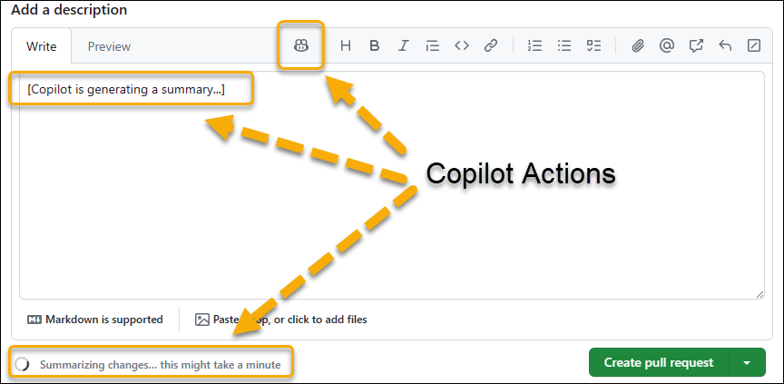

---
lab:
  title: Implementieren des Arbeitsablaufs mit GitHub
  module: Develop with DevOps
---

# Lab 02 – Implementieren des Arbeitsablaufs mit GitHub

## Geschätzte Zeit: 30 Minuten

## Szenario

Stellen Sie sich vor, Sie arbeiten für ein Softwareentwicklungsunternehmen in der Einzelhandelsbranche, das plant, einen Online-Store von einer alten App zu einer neuen App zu migrieren. Da Sie sich entschieden haben, Git und GitHub zu verwenden, um die Verwaltung des Anwendungslebenszyklus zu erleichtern, bietet Ihnen dieses Lab die Möglichkeit, zunächst ein vorhandenes Repository zu erstellen, es zu konfigurieren, ein Problem zu erstellen, eine Verzweigung zu erstellen, Dateien in der Verzweigung zu aktualisieren, eine Pullanforderung zu erstellen und zusammenzuführen, das Problem zu schließen und die Änderungen zu überprüfen.

## Ziele

Dieses Lab deckt Folgendes ab:

- Implementieren und Verwalten von Repositorys mit GitHub

> **Hinweis:** Verwenden Sie für dieses und nachfolgen Labs dasselbe GitHub-Konto, das Sie für den Zweck des ersten Lab erstellt haben.

## Voraussetzungen

- Abgeschlossen [Lab 01 – Agile Planung und Verwaltung mit GitHub](01-agile-planning-management-using-github.md)

## Übung 1: Implementieren und Verwalten von Repositorys mit GitHub

In dieser Übung forken Sie ein Git-Repository und verwalten es mithilfe von GitHub.

> **Wichtig:** Der GitHub Copilot für die Verwendung von Pull-Anforderungsfeatures ist vollständig optional. Um dieses Feature zu verwenden, müssen Sie Mitglied eines Unternehmens mit einem **Copilot Enterprise-Abonnement** sein. Sie können die Schritte überspringen, die das Feature GitHub Copilot für Pull Requests umfassen, wenn Sie keinen Zugriff darauf haben. Wenn Sie mehr über das Feature GitHub Copilot für Pull Requests wissen möchten, lesen Sie [Pull Request-Zusammenfassungen in Copilot](https://docs.github.com/en/enterprise-cloud@latest/copilot/github-copilot-enterprise/copilot-pull-request-summaries/about-copilot-pull-request-summaries).

> **Hinweis:** Sie haben im ersten Lab unseres Kurses ein neues Repository erstellt. In diesem Lab beginnen Sie mit dem Forken eines vorhandenen Repositorys. Ein Fork ist ein Repository, das Code- und Sichtbarkeitseinstellungen für ein vorhandenes Upstream-Repository freigibt. Dieser Ansatz wird häufig bei der Entwicklung von Updates für Open-Source-Projekte oder in Szenarien verwendet, in denen kein Schreibzugriff auf das Upstream-Repository möglich ist. Weitere Informationen finden Sie unter [Arbeiten mit Forks](https://docs.github.com/en/pull-requests/collaborating-with-pull-requests/working-with-forks).

Die Übung umfasst die folgenden Aufgaben:

- Aufgabe 1: Forken eines GitHub-Repositorys
- Aufgabe 2: Konfigurieren eines GitHub-Repositorys
- Aufgabe 3: Problem erstellen
- Aufgabe 4: Branch erstellen
- Aufgabe 5: Aktualisieren von Dateien im Branch
- Aufgabe 6: Erstellen und Mergen eines Pull Requests
- Aufgabe 7: Schließen des Problems
- Aufgabe 8: Überprüfen der Änderungen

### Aufgabe 1: Forken eines GitHub-Repositorys

1. Starten Sie einen Webbrowser, und navigieren Sie zur [GitHub](https://github.com)-Startseite.
1. Wenn Sie zur Authentifizierung aufgefordert werden, melden Sie sich mit Ihrem GitHub-Benutzerkonto an.
1. Öffnen Sie in demselben Browserfenster eine andere Registerkarte, und navigieren Sie zum [Spoon-Knife](https://github.com/octocat/Spoon-Knife)-Repository.
1. Wählen Sie auf der Repository-Seite **Spoon-Knife** die Option **Fork** aus.
1. Vergewissern Sie sich auf der Seite **Neuen Fork erstellen**, dass der Eintrag in der Dropdownliste **Besitzer** Ihren GitHub-Benutzernamen anzeigt, übernehmen Sie den Standardeintrag **Spoon-Knife** im Textfeld **Repositoryname**, lassen Sie das Kontrollkästchen **Nur Mainbranch kopieren** aktiviert, und wählen Sie dann **Fork erstellen** aus.

   > **Hinweis:** Ihre Browsersitzung wird automatisch zum neu erstellten geforkten Repository umgeleitet.

### Aufgabe 2: Konfigurieren eines GitHub-Repositorys

1. Wählen Sie auf der Repository-Seite **Spoon-Knife** in der Symbolleiste **Einstellungen** aus.
1. Beachten Sie im Abschnitt **Allgemein** der Registerkarte **Einstellungen**, dass die Standardverzweigung auf **main* festgelegt ist.
1. Navigieren Sie zum Bereich **Features** des Abschnitts **Allgemeinen**, und aktivieren Sie das Kontrollkästchen **Probleme**.
1. Wählen Sie im linken Navigationsmenü in der Gruppierung **Code und Automatisierung** den Eintrag **Seiten** aus.
1. Ändern Sie im Bereich **GitHub-Seiten** im Abschnitt „Branch“ den Eintrag **Keine** in der Dropdownliste in **main**, und wählen Sie dann **Speichern** aus.

   > **Hinweis:** GitHub-Seiten veröffentlichen automatisch den Inhalt des Repositorys auf einer Website, auf die über die URL `https://<your_GitHub_username>.github.io/Spoon-Knife/` zugegriffen werden kann.

1. Wählen Sie im Bereich **GitHub-Seiten** die Schaltfläche **Website besuchen** aus. Dadurch wird automatisch eine andere Webbrowserregisterkarte geöffnet und die Seite angezeigt, die den aktuellen Inhalt der index.html-Datei darstellt.

   > **Hinweis:** Möglicherweise müssen Sie einige Minuten warten, bevor die Schaltfläche **Website besuchen** und die Seite verfügbar sind.

   > **Hinweis:** Führen Sie die verbleibenden Schritte dieser Aufgabe aus, wenn Sie die erste Übung abgeschlossen haben.

1. Wählen Sie auf der Repository-Seite **Spoon-Knife** in der Symbolleiste **Projekte** aus.
1. Wählen Sie im Bereich **Willkommen bei den neuen Projekten** die Option **Projekt verknüpfen** aus, und wählen Sie im Dropdownmenü **Vorhandenes Projekt verknüpfen** aus.
1. Wählen Sie in der Liste der vorhandenen Projekte **DevOps Core Intro Project** aus.

### Aufgabe 3: Problem erstellen

1. Wählen Sie auf der Seite **Spoon-Knife** die Registerkarte **Probleme** aus.
1. Klicken Sie auf der Seite **Willkommen bei Problemen!** auf **Neues Problem**.
1. Geben Sie in das Textfeld **Titel hinzufügen** **`index.html looks rather austere`** ein.
1. In das Textfeld **Beschreibung hinzufügen** geben Sie **`index.html file can use a modern touch`** ein.
1. Wählen Sie im aktuellen Bereich im Abschnitt „Zugewiesene Personen“ **Zugewiesene Personen hinzufügen…** aus, und wählen Sie im Abschnitt **Vorschläge** Ihren GitHub-Benutzernamen aus.
1. Wählen Sie das Zahnradsymbol neben dem Eintrag **Bezeichnungen** aus, und wählen Sie in der Dropdownliste **Verbesserung** aus.
1. Wählen Sie das Zahnradsymbol neben dem Eintrag **Projekte** aus, und wählen Sie in der Dropdownliste **DevOps Core Intro Project** aus.
1. Klicken Sie auf **Neues Problem übermitteln**.
1. Im Bereich **index.html looks rather austere** im Abschnitt **Projekte** legen Sie **Status** auf **In Bearbeitung** fest.
1. Wählen Sie auf der Seite **Spoon-Knife** die Registerkarte **Projekte** aus.
1. Wählen Sie auf der Seite **Willkommen bei den neuen Projekten** die Option **DevOps Core Intro Project** aus.
1. Überprüfen Sie in der Boardansicht von **DevOps Core Intro Project** die Spalte **In Bearbeitung**, und beachten Sie, dass sie das neu erstellte Problem enthält.

### Aufgabe 4: Branch erstellen

1. Wechseln Sie zurück zur Registerkarte **Code**.
1. Wählen Sie in der oberen linken Ecke der Seite den Eintrag **main** aus, um die Dropdownliste **Verzweigungen/Tags wechseln** anzuzeigen.
1. Geben Sie in das Textfeld **Eine Verzweigung suchen oder erstellen...** **`update index.html`** ein und wählen Sie dann **Verzweigung erstellen: index.html aus dem Eintrag „main“ aktualisieren** aktualisieren, um eine neue Verzweigung zu erstellen.

   > **Hinweis:** Dadurch wird die neu erstellte Verzweigung automatisch zur aktuellen Verzweigung, wie durch den Inhalt der Dropdownliste angegeben.

### Aufgabe 5: Aktualisieren von Dateien im Branch

1. Wählen Sie auf der geforkten Repository-Seite **Spoon-Knife** in der Liste der Dateien **index.html** aus.
1. Wählen Sie auf der Seite **Spoon-Knife/index.html** auf der rechten Seite in der Code-Editor-Symbolleiste das Stiftsymbol aus, um zum Editormodus zu wechseln.
1. Ersetzen Sie im Editorbereich das gesamte Textkörperelement der Seite (Zeilen 12-17) durch den folgenden HTML-Code:

   ```html
   <div id="octocat">
     
   </div>

   <p>
     Ready to team up? Let's collaborate, @octocat!
   </p>
   ```

1. Wählen Sie rechts oben auf der Seite die Option **Änderungen committen** aus.
1. Geben Sie im Fenster **Änderungen committen** in das Textfeld **Erweiterte Beschreibung** **`Modified the image and paragraph text`** ein, akzeptieren Sie die Standard-Commit-Mitteilung und wählen Sie **Änderungen committen**.

   > **Hinweis:** Sie haben auch die Möglichkeit, an diesem Punkt eine neue Verzweigung für den Commit zu erstellen.

1. Wählen Sie in der Auflistung der Repositorydateien auf der linken Seite **styles.css** aus.
1. Wählen Sie auf der Seite **Spoon-Knife/styles.css** auf der rechten Seite in der Code-Editor-Symbolleiste das Stiftsymbol aus, um zum Editormodus zu wechseln.
1. Ersetzen Sie im Editorbereich die Zeile 17 durch den gesamten folgenden HTML-Code:

   ```css
     color: #333;
     line-height: 1.5;
     text-align: center;
   }

   body {
     font-family: 'Segoe UI', Tahoma, Geneva, Verdana, sans-serif;
     background-color: #f8f9fa;
   }

   #octocat img {
     display: block;
     width: 100%;
     height: auto;
   }
   ```

1. Wählen Sie rechts oben auf der Seite die Option **Änderungen committen** aus.
1. Geben Sie im Fenster **Änderungen committen** in das Textfeld **Erweiterte Beschreibung** **`Modified CSS tags and selectors`** ein, akzeptieren Sie die Standard-Commit-Mitteilung und wählen Sie **Änderungen committen** aus, um die Änderungen an der Verzweigung „update-index.html“ zu committen.

### Aufgabe 6: Erstellen und Mergen eines Pull Requests

1. Navigieren Sie zurück zur geforkten Repository-Seite **Spoon-Knife**.
1. Stellen Sie sicher, dass Sie die Verzweigung **update-index.html** anzeigen, wie durch die Beschriftung angegeben, die in der Dropdownliste in der oberen linken Ecke der Seite angezeigt wird. Wenn diese Bezeichnung **main** anzeigt, wählen Sie sie zuerst aus, und wählen Sie dann in der Dropdownliste, die die Liste der Verzweigungen enthält, **update-index.html** aus.
1. Wählen Sie auf der Repository-Seite **Spoon-Knife** die Option **Mitwirken** aus, und wählen Sie dann **Pull Request öffnen** aus.
1. Wählen Sie auf der Seite **Pull Request öffnen** den Eintrag **Basis-Repository: octocat/Spoon-Knife** aus.
1. Wählen Sie in der Dropdownliste **Basis-Repository auswählen** den Namen des geforkten Repositorys aus, das Sie am Anfang dieser Übung erstellt haben.

   > **Hinweis:** Der Name beginnt mit Ihrem GitHub-Namen, gefolgt von einem Schrägstrich, gefolgt von **Spoon-Knife**. Nachdem Sie es ausgewählt haben, sollte sich der Eintrag in **base: main** ändern.

   > **Hinweis:** Dies ist erforderlich, da wir die Hauptverzweigung im geforkten Repository statt der Hauptverzweigung in dem Repository aktualisieren möchten, aus dem Sie den Fork erstellt haben.

1. Ersetzen Sie im Textfeld **Titel hinzufügen** **index.html aktualisieren** durch **index.html und styles.css aktualisieren**.

1. (Optional) Wenn Sie Zugriff auf das Feature GitHub Copilot für Pull Requests haben, klicken Sie im Textfeld **Beschreibung hinzufügen** auf die Schaltfläche **Copilot-Aktion**, und wählen Sie dann **Zusammenfassung** aus (Generiren einer Zusammenfassung der Änderungen in der Pull Request).

   1. Das Feature GitHub Copilot für Pull Requests generiert eine Zusammenfassung der Änderungen an der Pull Request.

       

   1. Überprüfen Sie die Zusammenfassung, die vom Feature GitHub Copilot für Pull Requests generiert wurde.

   1. Nachdem die Zusammenfassung erstellt wurde, geben Sie **`Addressing #1`** in das Feld **Beschreibung hinzufügen** in der ersten Zeile ein und wählen **Pull Request erstellen**.

       

   > **Hinweis:** Wenn Sie keinen Zugriff auf das Feature GitHub Copilot für Pull Requests haben, können Sie diesen Schritt überspringen.

   > **Hinweis:** Wenn Sie das Feature GitHub Copilot für Pull Requests verwenden möchten, können Sie den nächsten Schritt überspringen.

1. Geben Sie in das Textfeld **Beschreibung hinzufügen** **`Addressing #1`** ein und wählen Sie **Pull Request erstellen**.

   > **Hinweis:** Indem Sie **#1** einschließen, können Sie auf das erste Problem verweisen, das dieser Pull Request zugeordnet ist.

1. Vergewissern Sie sich, dass die aktuelle Verzweigung keine Konflikte mit der Basisverzweigung hat, wählen Sie **Pull Request zusammenführen** aus, und wählen Sie dann **Zusammenführen bestätigen** aus.
1. Stellen Sie sicher, dass die Pull Request erfolgreich zusammengeführt und geschlossen wurde, und wählen Sie **Verzweigung löschen** aus.

### Aufgabe 7: Schließen des Problems

1. Wählen Sie auf der Symbolleiste der GitHub-Seite die Registerkarte **Probleme** aus.
1. Aktivieren Sie das Kontrollkästchen links neben dem ersten Problem, **index.html looks rather austere**, wählen Sie **Markieren als** aus, und wählen Sie in der Dropdownliste **Geschlossen** aus.
1. Navigieren Sie zurück zur Boardansicht des **DevOps Core Intro Project**, und beachten Sie, dass das Problem jetzt in der Spalte **Erledigt** angezeigt wird.

### Aufgabe 8: Überprüfen der Änderungen

1. Navigieren Sie im Webbrowserfenster zurück zu Ihrer geforkten Repository-Seite **Spoon-Knife**, wählen Sie die Registerkarte **Einstellungen** aus, und wählen Sie dann im linken Navigationsmenü in der Gruppierung **Code und Automatisierung** die Option **Seiten** aus, um den Bereich **GitHub-Seiten** anzuzeigen.
1. Wählen Sie im Bereich **GitHub-Seiten** den Eintrag **Website besuchen** aus, um eine andere Browserregisterkarte zu öffnen, auf der der aktualisierte Inhalt der index.html-Datei angezeigt wird.
1. Stellen Sie sicher, dass die Seite aktualisiert wurde, um die visuellen Elemente einzuschließen, auf die in den HTML- und CSS-Dateien verwiesen wird.

> **Hinweis:** An diesem Punkt könnten Sie möglicherweise Änderungen an der Hauptverzweigung in Ihrer Verzweigung zurück an das ursprüngliche Repository senden. Dies wäre in der Regel der nächste Schritt bei der Entwicklung von Updates und der Zusammenarbeit an Open-Source-Projekten. Da das ursprüngliche Repository jedoch nicht beibehalten wird, findet dieser Schritt hier keine Anwendung.
